## Задание #1. Развёртывание Kafka-кластера в Yandex Cloud

### Цель

В этой практической работе мы применим теоретические знания, освоенные в модуле «Kafka в production и интеграция Kafka с Big Data экосистемой». Наша задача - самостоятельно развернуть кластер Kafka в облачной среде Yandex Cloud, настроить его для продакшн-среды, а также интегрировать его с внешней системой.  

### Подзадачи

В рамках работы нам предстоит выполнить два основных подзадания:  

1. Развёртывание и настройка Kafka-кластера в Yandex Cloud.  
   - Развернуть кластер Kafka с тремя брокерами.  
   - Настроить репликацию, создание топиков и параметры хранения данных.  
   - Установить и настроить Schema Registry для работы с данными.  

2. Проверка работы Kafka.  
   - Написать простые приложения - продюсера и консьюмера.  
   - Отправить тестовые сообщения и проверить их успешную передачу.  

## Изучаемые компоненты и требования

- Yandex Cloud: Используем стартовый грант для работы в облачной среде.  
- Apache Kafka: Проверяем, что у нас есть доступ к Yandex Managed Service for Apache Kafka®.  
- Данные и схемы: Используем формат Avro или JSON для описания данных.  
- Проверка результатов: Используем команду curl для проверки работы Schema Registry   
и описания топиков, а также просмотр соответствующих log-файлов.  

### Последовательность шагов, настройка, Yandex Cloud (шаги «по‑порядку»)

Для создания и настройки Kafka-кластера воспользуемся следующей документацией и пошаговыми инструкциями:  

1. Создание виртуальной машины  

	Создать виртуальную машину из публичного образа Linux  
	https://yandex.cloud/ru/docs/compute/operations/vm-create/create-linux-vm  
	
	Подключиться к виртуальной машине Linux по SSH  
	https://yandex.cloud/ru/docs/compute/operations/vm-connect/ssh  
	
	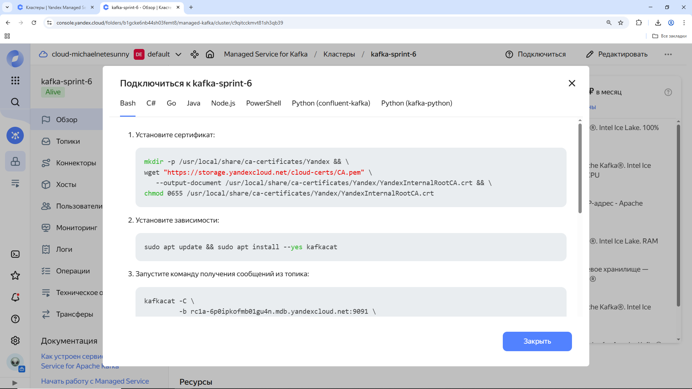

	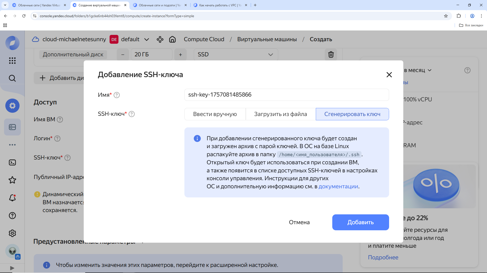
	
	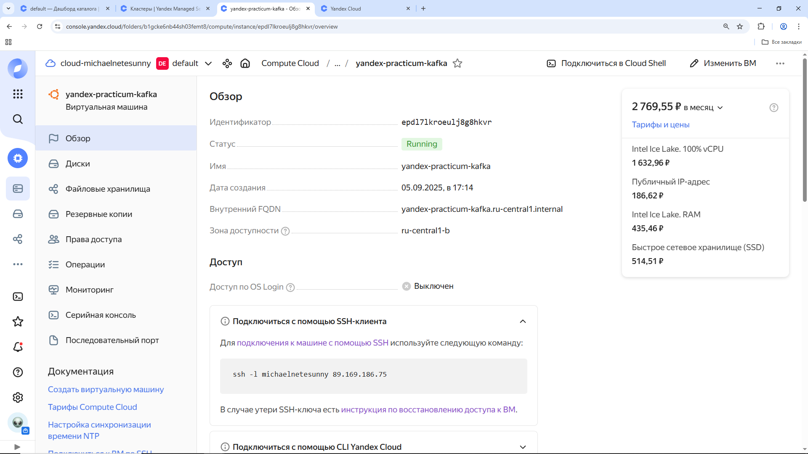

	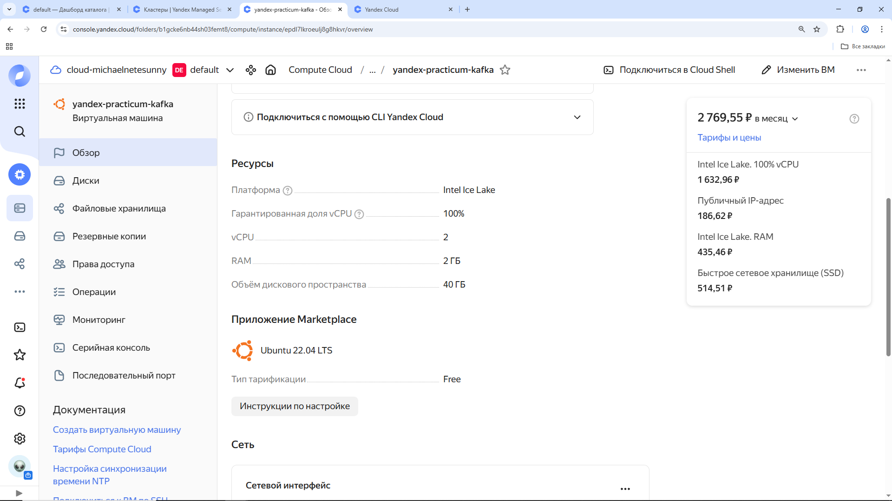

	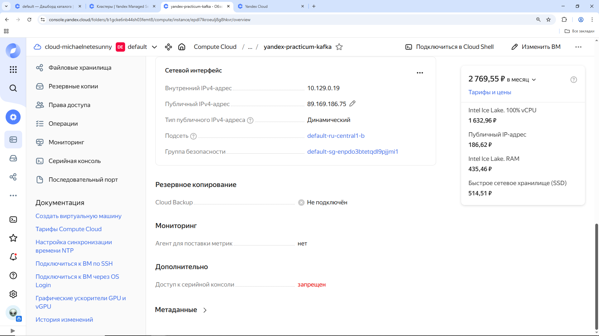
	
	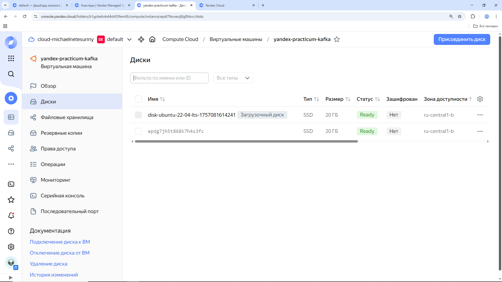

	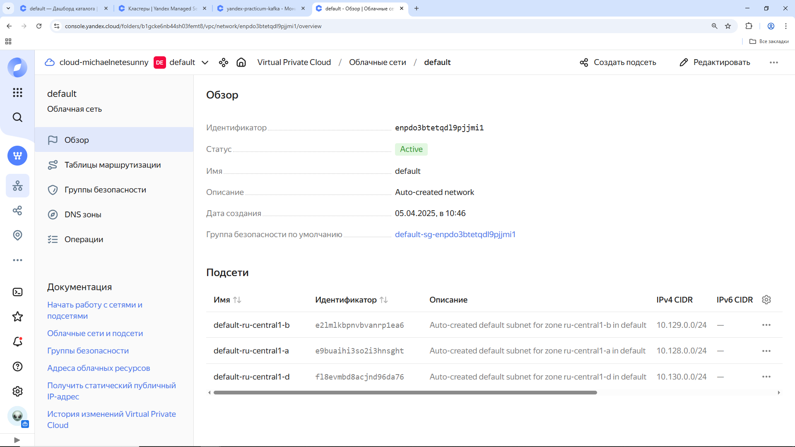

2. Managed Service for Apache Kafka  

	Как начать работать с Managed Service for Apache Kafka®  
	https://yandex.cloud/ru/docs/managed-kafka/quickstart  

	Управление топиками Apache Kafka®  
	https://yandex.cloud/ru/docs/managed-kafka/operations/cluster-topics#console_1  

	Управление пользователями Apache Kafka®  
	https://yandex.cloud/ru/docs/managed-kafka/operations/cluster-accounts  

	Предварительная настройка для подключения к кластеру Apache Kafka®  
	https://yandex.cloud/ru/docs/managed-kafka/operations/connect/  
	
	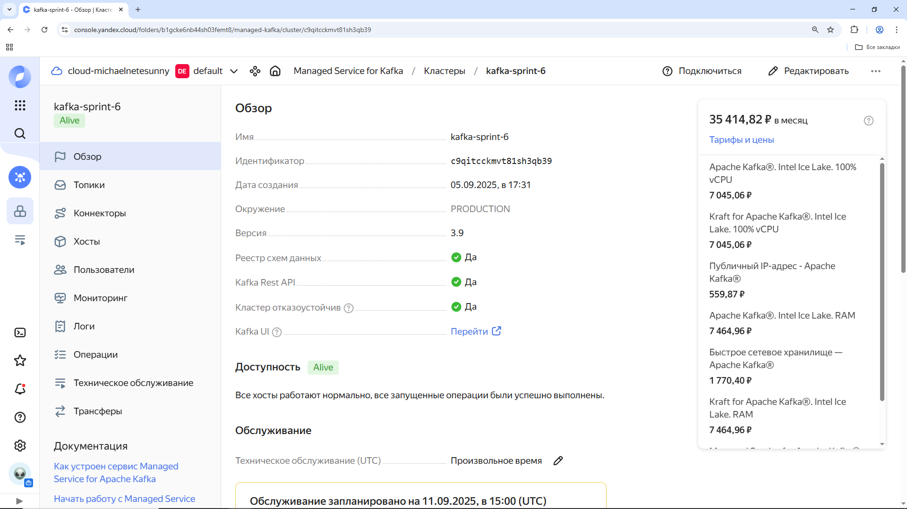

	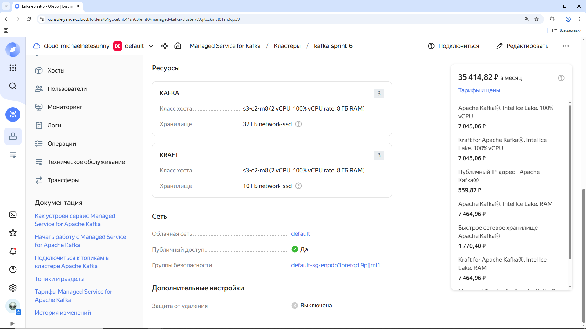

	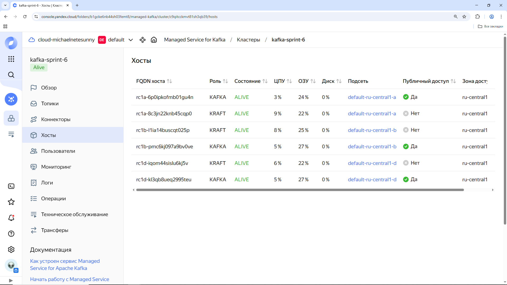

	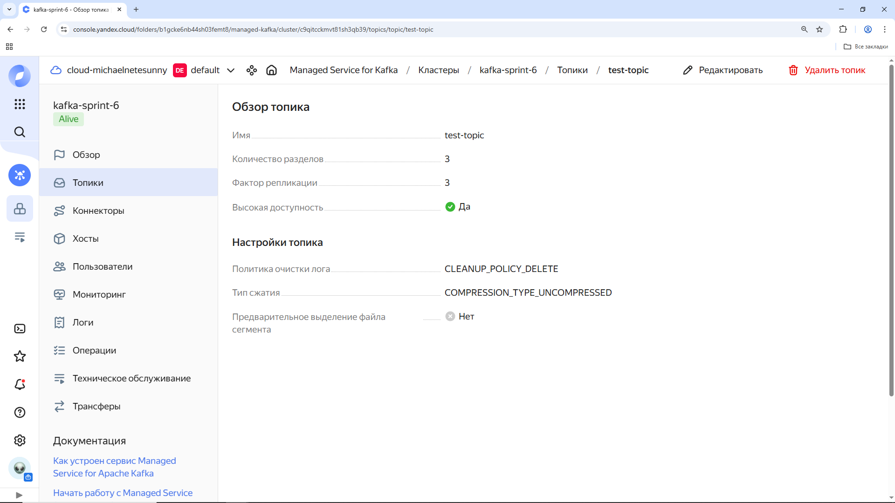

	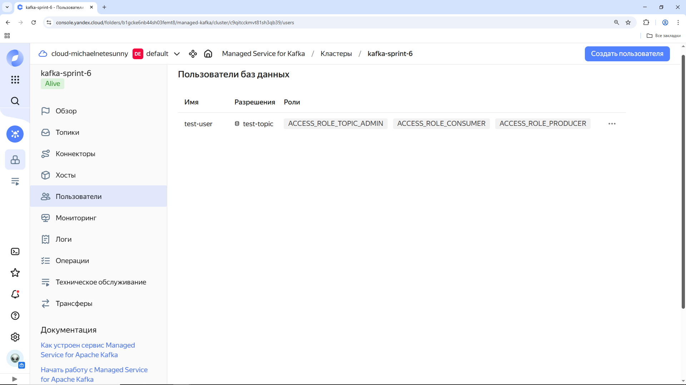

3.  Managed Schema Registry  
	
	Управление схемами данных в Managed Service for Apache Kafka®  
	https://yandex.cloud/ru/docs/managed-kafka/tutorials/managed-schema-registry  

4. Веб-интерфейс Kafka UI  

	Веб-интерфейс Kafka UI для Apache Kafka®  
	https://yandex.cloud/ru/docs/managed-kafka/operations/kafka-ui-enable  
	
	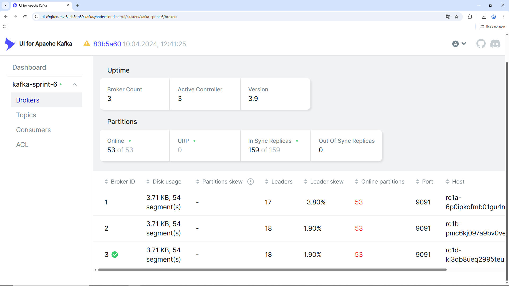

	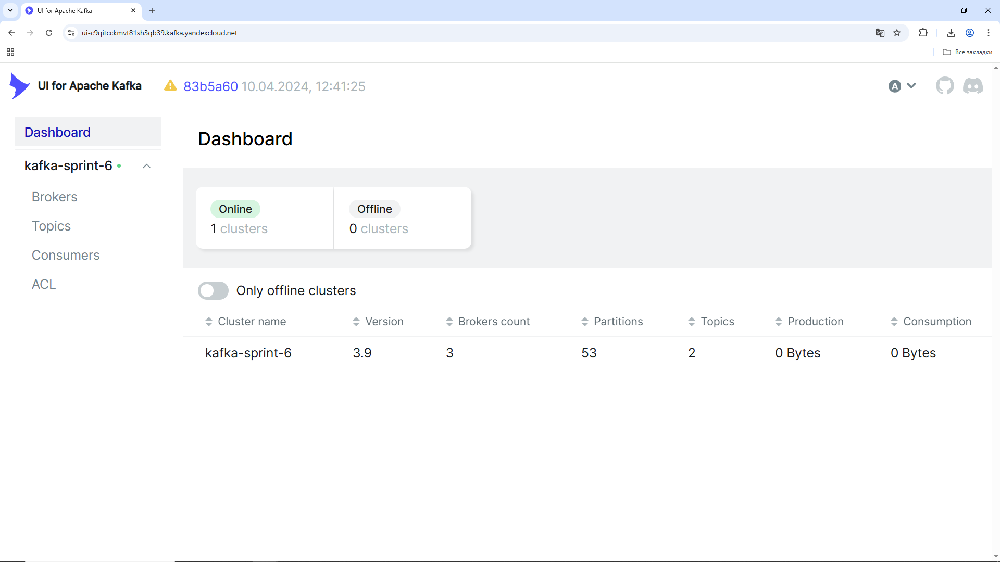

	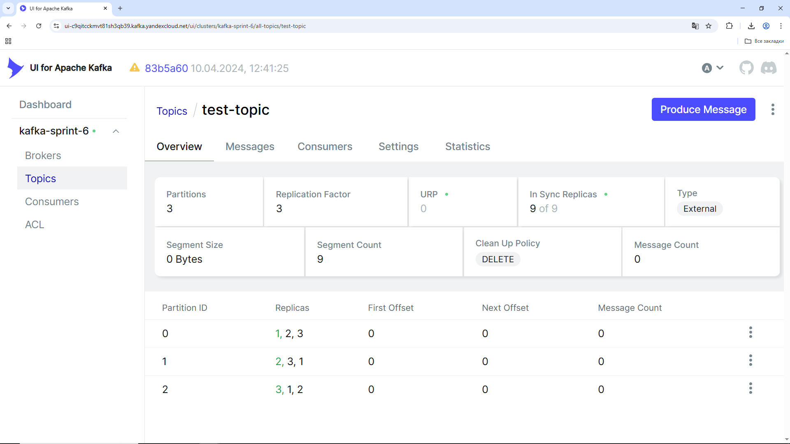

	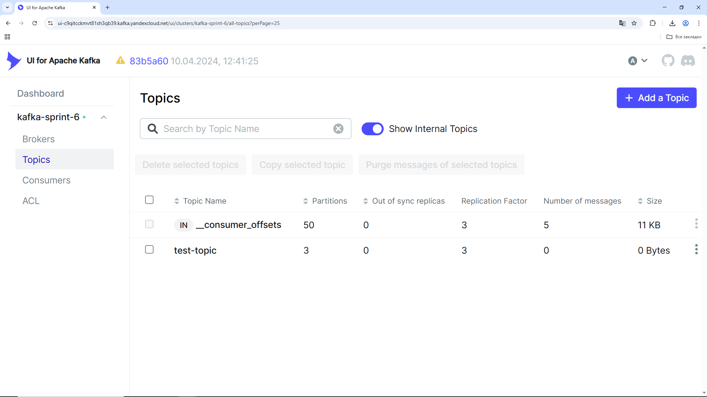
	
### Рекомендации по настройкам Kafka-кластера для production-среды

Для обеспечения надежности и эффективности Kafka-кластера в рабочей среде рекомендуется использовать следующие настройки:  

1. **Количество брокеров**: 3    
   - Обеспечивает необходимую отказоустойчивость и позволяет использовать фактор репликации 3.  

2. **CPU**: 4 vCPU на брокер (рекомендуется 8+ vCPU для высоких нагрузок)    
   - 4 vCPU — минимально достаточный ресурс для умеренных нагрузок. Для ожидания высоких нагрузок следует рассмотреть увеличение до 8 и более.  

3. **RAM**: минимум 16 GB на брокер (лучше 32GB и более)    
   - 16 GB достаточно для буферов и JVM heap, начиная с минимальной конфигурации на уровне 8-12 GB.  

4. **Тип дисков**: NVMe SSD или несколько SSD (например, 1x NVMe 1TB или 2-3 SSD по 500 GB)    
   - Важно выбирать диски с высоким IOPS и throughput для предотвращения задержек.  

5. **Политика очистки логов**: log.cleanup.policy = delete    
   - Удаляет старые данные на основе времени хранения и максимального размера лога.  

6. **Параметры хранения**:  
   - log.retention.ms = 604800000 (7 дней) — максимальное время хранения сообщений.  
   - log.retention.size = 1073741824 (1 ГБ) — максимальный размер лога, после которого старые сегменты удаляются, если достигнут лимит.  

7. **Количество партиций для топика**: 3    
   - Обеспечивает необходимый параллелизм и throughput для консьюмеров.  

8. **Коэффициент репликации**: 3    
   - Гарантирует наличие резервных копий данных на всех брокерах.  

9. **Настройки потока и сети**:  
   - num.io.threads = 8 и num.network.threads = 8 — значения, достаточные для обработки средней нагрузки, могут быть увеличены в зависимости от конфигурации.  

### Значения по умолчанию в Yandex Cloud для тестовой лабораторной среды

Для тестовой лабораторной среды в Yandex Cloud, используя Yandex Managed Service for Apache Kafka, применяются следующие значения по умолчанию:

1. **Количество брокеров**: 3 (по умолчанию)  
2. **CPU**: Зависит от выбранного класса экземпляра, обычно начинается с 2 vCPU.  
3. **RAM**: Зависит от выбранного класса экземпляра, может составлять от 8 GB.  
4. **Тип дисков**: По умолчанию используются стандартные SSD диски (например, сети SSD).  
5. **Политика очистки логов**: log.cleanup.policy = delete (по умолчанию)  
6. **Дефолтные параметры хранения**:  
   - **log.retention.ms**: часто устанавливается на 168 часов (7 дней).  
   - **log.retention.size**: настройки варьируются, но могут быть установлены на 1 ГБ по умолчанию.  
7. **Количество партиций для топика**: Используем 3, исходя из условий задания.  
8. **Коэффициент репликации**: Используем 3, исходя из условий задания.  

Более точные значения (в т.ч. настройка VM, диски, Schema Registry) см. на соответствующих скриншотах 
(учитываем , что значения по умолчанию в Yandex Cloud могут со временем меняться).

### Развёртывание Schema Registry и регистрация схемы.

Схемы данных обычно описываются в формате Avro (.avsc) или JSON Schema.   

#### Регистрация Схемы Данных

Создадим/зарегистрируем две схемы, topic‑key и topic‑value.  

#### Описание схем

- Наше Kafka сообщение будет состоять из ключа и значения (key и value). Они используются по‑разному: value — основное содержимое, key — для маршрутизации/партиционирования и для дедупликации/идентификации сообщений.  
- Schema Registry хранит схемы в контексте subject (обычно topic‑name‑key и topic‑name‑value). Это даёт независимое эволюционирование правил совместимости для ключа и для значения.  

Практические причины разделения на две схемы:  
- Разные семантики и требования к совместимости. Value можно расширять (добавлять опциональные поля), а key, как правило, должен оставаться стабильным, потому что изменение key меняет партиционирование/поведение потребителей.  
- Key часто проще — строка, UUID или небольшой record. Не нужно в value включать поля, нужные только для партиционирования.  
- Разные политики совместимости: мы можем настроить более строгую политику для key (BACKWARD/REJECT) и более мягкую для value.  
- Переиспользование: одна и та же value‑схема может использоваться в нескольких topic'ах; то же для key — независимое управление версий.  
  
- Мы можем хранить одну схему для key и value, если логика проста и key по сути — часть value (и мы готовы, чтобы они эволюционировали синхронно). Но это уменьшает гибкость и может привести к проблемам при изменениях.  
- Если key — просто строка/UUID, часто не имеет смысла регистрировать сложную Avro‑схему для key: можно оставить key как plain string/bytes и не регистрировать вовсе.  

См. файлы [key.avsc](./key.avsc), [value.avsc](./value.avsc)  

#### Создание и регистрация схем

Подключившись к удалённой виртуальной машине, выполняем:  

```
cat > key.avsc <<'EOF'
{
  "type": "record",
  "name": "key",
  "namespace": "my.test",
  "fields": [
    { "name": "name", "type": "string" }
  ]
}
EOF

cat > value.avsc <<'EOF'
{
  "type": "record",
  "name": "value",
  "namespace": "my.test",
  "fields": [
    { "name": "name", "type": "string" }
  ]
}
EOF
```

Содержимое payload-value.json:  
`{"schema":"{\"type\":\"record\",\"name\":\"value\",\"namespace\":\"my.test\",\"fields\":[{\"name\":\"name\",\"type\":\"string\"}]}"}`

Содержимое payload-key.json:  
`{"schema":"{\"type\":\"record\",\"name\":\"key\",\"namespace\":\"my.test\",\"fields\":[{\"name\":\"name\",\"type\":\"string\"}]}"}`

Команды, чтобы создать эти файлы и отправить их в Schema Registry (вставляем блок целиком в терминал):  

```
cat > payload-value.json <<'EOF'
{"schema":"{\"type\":\"record\",\"name\":\"value\",\"namespace\":\"my.test\",\"fields\":[{\"name\":\"name\",\"type\":\"string\"}]}"}
EOF

cat > payload-key.json <<'EOF'
{"schema":"{\"type\":\"record\",\"name\":\"key\",\"namespace\":\"my.test\",\"fields\":[{\"name\":\"name\",\"type\":\"string\"}]}"}
EOF
```

#### Отправка value
```
curl -s -u "test-user:test-password" -X POST "https://rc1a-6p0ipkofmb01gu4n.mdb.yandexcloud.net:443/subjects/test-topic-value/versions" \
  -H "Content-Type: application/vnd.schemaregistry.v1+json" --data-binary @payload-value.json
```

#### Отправка key
```
curl -s -u "test-user:test-password" -X POST "https://rc1a-6p0ipkofmb01gu4n.mdb.yandexcloud.net:443/subjects/test-topic-key/versions" \
  -H "Content-Type: application/vnd.schemaregistry.v1+json" --data-binary @payload-key.json
```

#### Проверка

Выполним следующие команды по порядку:  
```
curl -s -u "test-user:test-password" "https://rc1a-6p0ipkofmb01gu4n.mdb.yandexcloud.net:443/subjects" | jq .
curl -s -u "test-user:test-password" "https://rc1a-6p0ipkofmb01gu4n.mdb.yandexcloud.net:443/subjects/test-topic-key/versions" | jq .
curl -s -u "test-user:test-password" "https://rc1a-6p0ipkofmb01gu4n.mdb.yandexcloud.net:443/subjects/test-topic-value/versions" | jq .
curl -s -u "test-user:test-password" "https://rc1a-6p0ipkofmb01gu4n.mdb.yandexcloud.net:443/subjects/test-topic-value/versions/latest" | jq .
curl -s -u "test-user:test-password" "https://rc1a-6p0ipkofmb01gu4n.mdb.yandexcloud.net:443/schemas/ids/1" | jq .
curl -s -u "test-user:test-password" "https://rc1a-6p0ipkofmb01gu4n.mdb.yandexcloud.net:443/schemas/ids/2" | jq .
```

Вывод:  

```
michaelnetesunny@yandex-practicum-kafka:~$ curl -s -u "test-user:test-password" "https://rc1a-6p0ipkofmb01gu4n.mdb.yandexcloud.net:443/subjects" | jq .

[
  "test-topic-key",
  "test-topic-value"
]

michaelnetesunny@yandex-practicum-kafka:~$ curl -s -u "test-user:test-password" "https://rc1a-6p0ipkofmb01gu4n.mdb.yandexcloud.net:443/subjects/test-topic-key/versions" | jq .

[
  1
]

michaelnetesunny@yandex-practicum-kafka:~$ curl -s -u "test-user:test-password" "https://rc1a-6p0ipkofmb01gu4n.mdb.yandexcloud.net:443/subjects/test-topic-value/versions" | jq .

[
  1
]

michaelnetesunny@yandex-practicum-kafka:~$ curl -s -u "test-user:test-password" "https://rc1a-6p0ipkofmb01gu4n.mdb.yandexcloud.net:443/subjects/test-topic-value/versions/latest" | jq .

{
  "id": 2,
  "schema": "{\"fields\":[{\"name\":\"name\",\"type\":\"string\"}],\"name\":\"value\",\"namespace\":\"my.test\",\"type\":\"record\"}",
  "subject": "test-topic-value",
  "version": 1
}

michaelnetesunny@yandex-practicum-kafka:~$ curl -s -u "test-user:test-password" "https://rc1a-6p0ipkofmb01gu4n.mdb.yandexcloud.net:443/schemas/ids/1" | jq .

{
  "schema": "{\"fields\":[{\"name\":\"name\",\"type\":\"string\"}],\"name\":\"key\",\"namespace\":\"my.test\",\"type\":\"record\"}"
}

michaelnetesunny@yandex-practicum-kafka:~$ curl -s -u "test-user:test-password" "https://rc1a-6p0ipkofmb01gu4n.mdb.yandexcloud.net:443/schemas/ids/2" | jq .

{
  "schema": "{\"fields\":[{\"name\":\"name\",\"type\":\"string\"}],\"name\":\"value\",\"namespace\":\"my.test\",\"type\":\"record\"}"
}
```

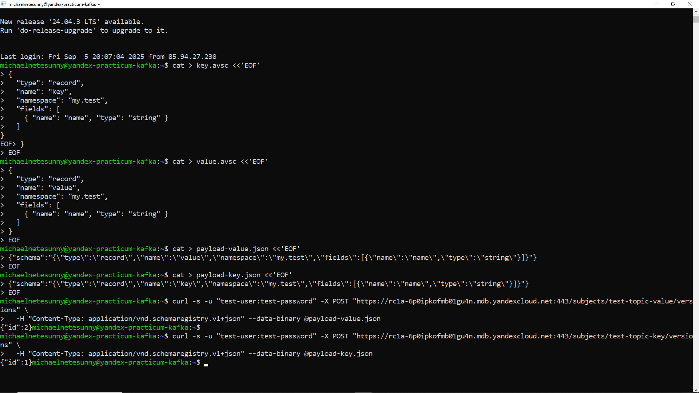

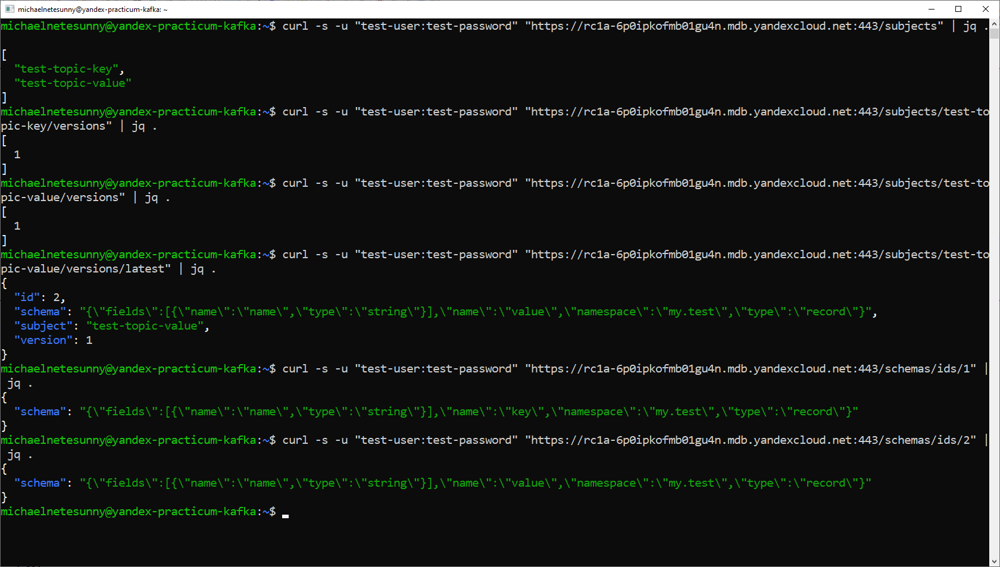

### Создание топика и пример вывода kafka-topics.sh --describe  

1. Для получения описания всех тем, воспользуемся приложением kafkacat:  

```
michaelnetesunny@yandex-practicum-kafka:~$ kafkacat -L -b rc1a-6p0ipkofmb01gu4n.mdb.yandexcloud.net:9091 \
>   -X security.protocol=SASL_SSL \
>   -X sasl.mechanism=SCRAM-SHA-512 \
>   -X sasl.username="test-user" \
>   -X sasl.password="test-password" \
>   -X ssl.ca.location=/usr/local/share/ca-certificates/Yandex/YandexInternalRootCA.crt
```

Вывод:  
```
Metadata for all topics (from broker 1: sasl_ssl://rc1a-6p0ipkofmb01gu4n.mdb.yandexcloud.net:9091/1):
 3 brokers:
  broker 1 at rc1a-6p0ipkofmb01gu4n.mdb.yandexcloud.net:9091
  broker 2 at rc1b-pmc6kj097a9bv0ve.mdb.yandexcloud.net:9091
  broker 3 at rc1d-kl3qb8ueq2995teu.mdb.yandexcloud.net:9091 (controller)
 1 topics:
  topic "test-topic" with 3 partitions:
    partition 0, leader 1, replicas: 1,2,3, isrs: 1,2,3
    partition 1, leader 2, replicas: 2,3,1, isrs: 2,3,1
    partition 2, leader 3, replicas: 3,1,2, isrs: 3,1,2
```

Для получения описания темы `test-topic`, воспользуемся приложением kafkacat:  

```
michaelnetesunny@yandex-practicum-kafka:~$ kafkacat -L -b rc1a-6p0ipkofmb01gu4n.mdb.yandexcloud.net:9091 \
>   -t test-topic \
>   -X security.protocol=SASL_SSL \
>   -X sasl.mechanism=SCRAM-SHA-512 \
>   -X sasl.username="test-user" \
>   -X sasl.password="test-password" \
>   -X ssl.ca.location=/usr/local/share/ca-certificates/Yandex/YandexInternalRootCA.crt
```

Вывод:  
```
Metadata for test-topic (from broker 1: sasl_ssl://rc1a-6p0ipkofmb01gu4n.mdb.yandexcloud.net:9091/1):
 3 brokers:
  broker 1 at rc1a-6p0ipkofmb01gu4n.mdb.yandexcloud.net:9091 (controller)
  broker 2 at rc1b-pmc6kj097a9bv0ve.mdb.yandexcloud.net:9091
  broker 3 at rc1d-kl3qb8ueq2995teu.mdb.yandexcloud.net:9091
 1 topics:
  topic "test-topic" with 3 partitions:
    partition 0, leader 1, replicas: 1,2,3, isrs: 1,2,3
    partition 1, leader 2, replicas: 2,3,1, isrs: 2,3,1
    partition 2, leader 3, replicas: 3,1,2, isrs: 3,1,2
```

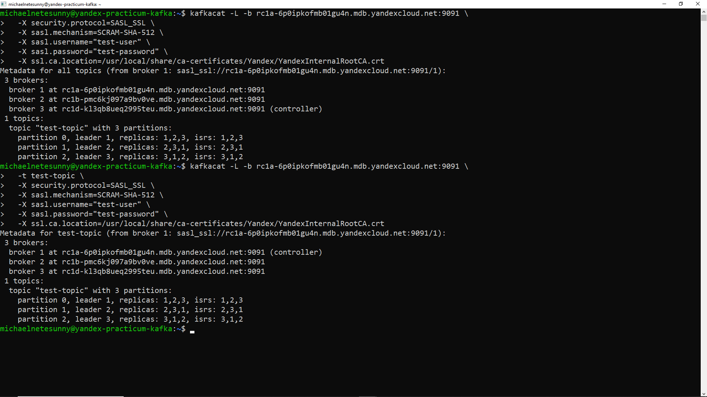

2. При необходимости можем также использовать на виртуальной машине утилиты 
базового инструментария, такие как, kafka-topics.sh, для этого воспользуемся следующей инструкцией:  

```
KAFKA_VERSION=3.4.0
KAFKA_DIST=kafka_2.13-$KAFKA_VERSION

wget -q https://downloads.apache.org/kafka/$KAFKA_VERSION/$KAFKA_DIST.tgz
tar xzf $KAFKA_DIST.tgz

mkdir -p $HOME/.kafka
TRUSTSTORE=$HOME/.kafka/truststore.jks

# импорт CA (если уже есть — перезапишет с тем же alias)

keytool -importcert -trustcacerts -alias yc-ca \
  -file /usr/local/share/ca-certificates/Yandex/YandexInternalRootCA.crt \
  -keystore "$TRUSTSTORE" -storepass storepass -noprompt

# создаём client.properties (полностью готовый)

cat > client.properties <<EOF

bootstrap.servers=rc1a-6p0ipkofmb01gu4n.mdb.yandexcloud.net:9091
security.protocol=SASL_SSL
sasl.mechanism=SCRAM-SHA-512
sasl.jaas.config=org.apache.kafka.common.security.scram.ScramLoginModule required username="test-user" password="test-password";
ssl.truststore.location=$TRUSTSTORE
ssl.truststore.password=storepass
EOF

# команды: описание конкретного топика и вывод всех топиков
$KAFKA_DIST/bin/kafka-topics.sh --bootstrap-server rc1a-6p0ipkofmb01gu4n.mdb.yandexcloud.net:9091 \
  --topic test-topic --describe --command-config client.properties

$KAFKA_DIST/bin/kafka-topics.sh --bootstrap-server rc1a-6p0ipkofmb01gu4n.mdb.yandexcloud.net:9091 \
  --list --command-config client.properties
```

### Пример продюсера и консьюмера

Описание: Для проверки работоспособности кластера Kafka и Schema Registry мы напишем простой Java-код для продюсера (отправляет сообщения) и консьюмера (получает сообщения). Для сериализации/десериализации будем использовать Avro и Schema Registry.  

При написании кода мы придерживались рекомендаций по настройкам из   

	Примеры кода для подключения к кластеру Apache Kafka®  
	https://yandex.cloud/ru/docs/managed-kafka/operations/connect/code-examples  
	
Перед подключением:  

1. Установливаем зависимости:  

```
sudo apt update && sudo apt install --yes default-jdk maven
```

2. Создаём директорию для проекта Maven:  

```
cd ~/ && \
mkdir --parents project/consumer/src/java/com/example project/producer/src/java/com/example && \
cd ~/project
```

3. Создаём конфигурационный файл для Maven:  

Актуальные версии зависимостей уточняем на страницах соответствующих проектов в репозитории Maven:  

```
kafka-clients;
jackson-databind;
slf4j-simple.
```

4. Скопируем `pom.xml` в директории приложения-производителя и приложения-потребителя:  

Файл сборки см. [pom.xml](pom.xml). Копируем с локальной машины:  

```
scp -i C:\Users\michaelnetesunny\.ssh\ssh-key-1757081485866 "pom.xml" michaelnetesunny@89.169.186.75:~/pom.xml
```

На удалённой машине:  
```
cp ~/pom.xml ~/project/producer/pom.xml
cp ~/pom.xml ~/project/consumer/pom.xml
```

5. Перейдём в каталог, где будет располагаться хранилище сертификатов Java:  

`cd /etc/security`  

Добавляем SSL-сертификат в хранилище доверенных сертификатов Java (Java Key Store), чтобы драйвер Apache Kafka® мог использовать этот сертификат при защищенном подключении к хостам кластера. Задаём пароль не короче 6 символов в параметре -storepass для дополнительной защиты хранилища:  

```
sudo keytool -importcert \
             -alias YandexCA -file /usr/local/share/ca-certificates/Yandex/YandexInternalRootCA.crt \
             -keystore ssl -storepass storepass \
             --noprompt
```

6. Кода для отправки сообщений в топик:  

На удалённой машине располагается в   
`producer/src/java/com/example/App.java`  

Файл (код класса) производителя см. [ProducerAvroApp.java](ProducerAvroApp.java). Копируем с локальной машины:  

```
scp -i C:\Users\michaelnetesunny\.ssh\ssh-key-1757081485866 "ProducerAvroApp.java" michaelnetesunny@89.169.186.75:~/ProducerAvroApp.java
cp ~/ProducerAvroApp.java ~/project/producer/src/java/com/example/App.java
```

7. Кода для получения сообщений из топика:  

На удалённой машине располагается в   
`consumer/src/java/com/example/App.java`  

Файл (код класса) потребителя см. [ConsumerAvroApp.java](ConsumerAvroApp.java). Копируем с локальной машины:  

```
scp -i C:\Users\michaelnetesunny\.ssh\ssh-key-1757081485866 "ConsumerAvroApp.java" michaelnetesunny@89.169.186.75:~/ConsumerAvroApp.java
cp ~/ConsumerAvroApp.java ~/project/consumer/src/java/com/example/App.java
```

8. Сборка приложений:  

```
cd ~/project/producer && mvn clean package
```
```
cd ~/project/consumer && mvn clean package
```

9. Запуск приложений:  

В одной консоли (для просмотра log-ов):  

```
java -jar ~/project/consumer/target/app-0.1.0-jar-with-dependencies.jar
```

В другой консоли (для просмотра log-ов):  

```
java -jar ~/project/producer/target/app-0.1.0-jar-with-dependencies.jar
```

Как получить FQDN хоста-брокера, см. в инструкции ранее   https://yandex.cloud/ru/docs/managed-kafka/operations/connect/#get-fqdn  

Т.е. сначала запускаем приложение-потребитель, которое будет непрерывно считывать новые сообщения из топика. Затем запускаем приложение-производитель, которое отправит в топик одно или несколько сообщений key:test message.   Приложение-потребитель отобразит сообщения, отправленные в топик.  

10. Журналы (вывод в console соответствующих приложений, производитель-потребитель)  

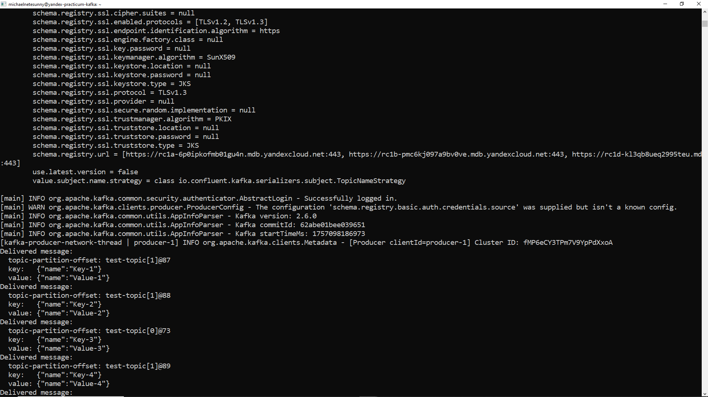

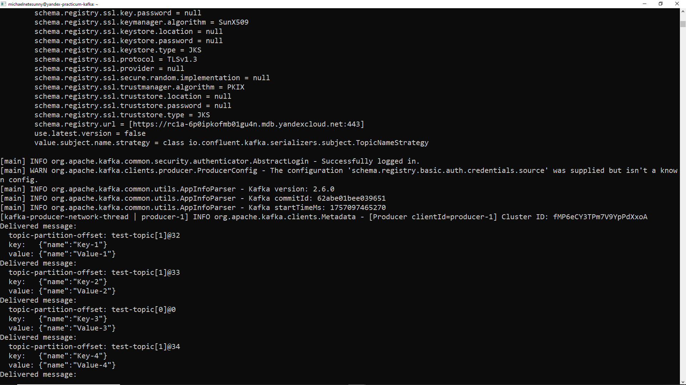

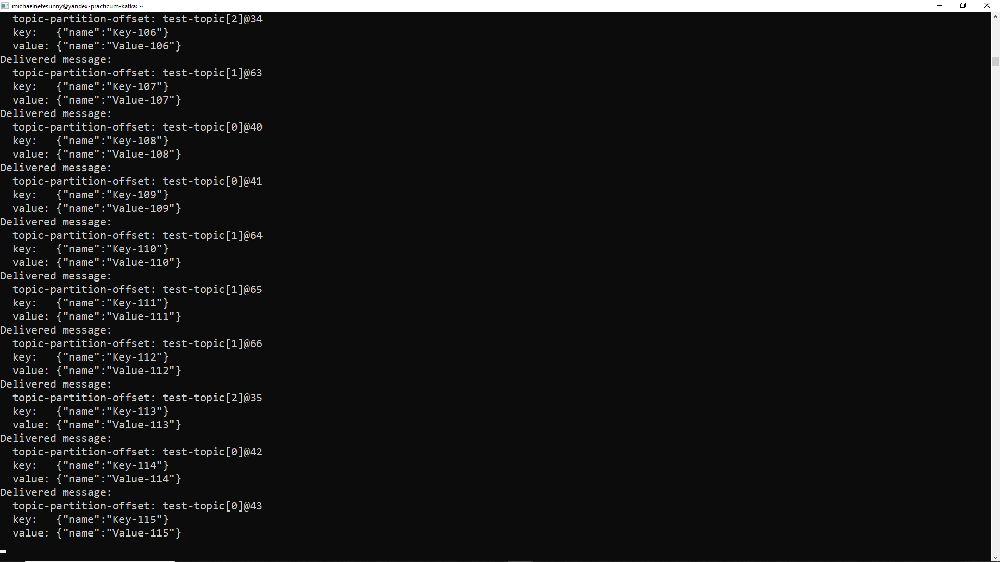

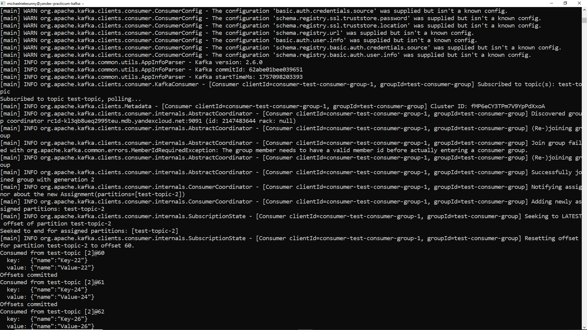

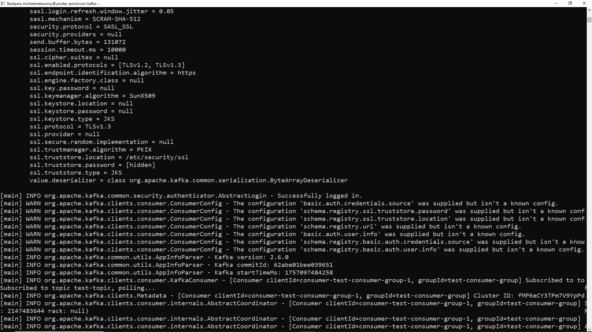

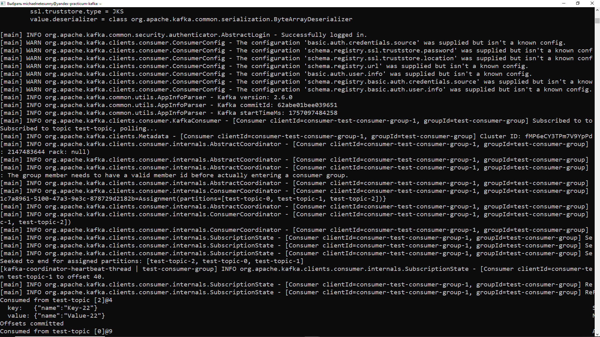

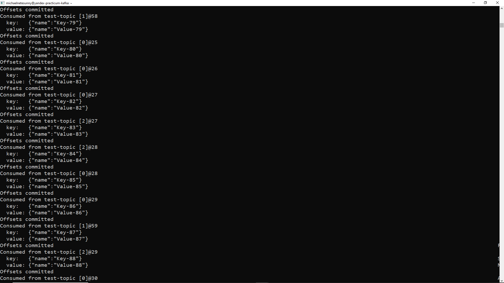

### Заключение

В ходе выполнения практической работы по развертыванию Kafka-кластера в Yandex Cloud были успешно применены полученные знания о настройке и управлении системами обработки данных.   

Кластер был развернут с использованием трех брокеров, что обеспечило необходимую масштабируемость и надежность. Настроенные параметры репликации и хранения данных позволили гарантировать высокую доступность информации и защиту от потерь. Интеграция с Schema Registry обеспечила корректную регистрацию и обработку схем данных, что является важным аспектом при работе с разнообразными источниками и форматами данных.   

Успешная проверка работы системы через тестовые сообщения, отправленные продюсером и прочитанные консьюмерами, подтвердила правильность настроек и функционирование кластера.  